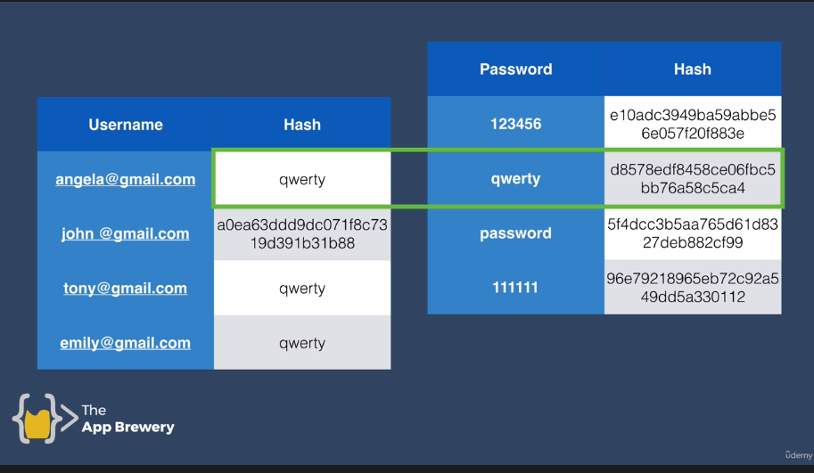

# I'ma skim through the rest of it
## Terrible from day 50-ish onwards
- the creator abandoned the course
- I'm not learning much, just googling errors
- at least 3-4 days were just a recycle of the web-dev course
- good for learning python fundamentals but the rest of it is super outdated/deprecated
- jut go to youtube and [roadmap.sh](roadmap.sh)
- :dizzy: means it's a good topic; study it more on YouTube
- > It's just that spending a week+ on something I don't really have an interest in or a talent for seems a bit of a waste, when I could instead learn other stuff.

## Day 66-67
- more about Postman than RESTful API
- watch Postman video on freecodecamp

## :dizzy: Day 68: Authentication

- learn SQL before all this copy-paste SQLite and SQLAlchemy
- take `user id` and `password` input using form
- save it to `users.db`
- show a success message to user
- `send_from_directory()` to send file to user
- use Flask_Login to ensure only registered users can access `/secret`

### Encryption and Hashing

- Level 1: `plaintext` password saved to database
- Level 2: Encryption: using a `key` to encode it
    - The imitation games
    - enigma machine
    - videos by [numberphile](https://www.youtube.com/watch?v=G2_Q9FoD-oQ&ab_channel=Numberphile)
- Level 3: Hashing: use a `hash function` (math) and save the output to server database
    - [https://cryptii.com/](https://cryptii.com/)
    - `same input always gives same output` in a hash function
    - vulnerability: commonly used passwords can be used to reverse-engineer the hash
    - **Dictionary Attack**: systematically entering every word in a dictionary as a password

- **Salting**: `password + salt -> hash function -> hash`
  - salt is a random set of characters
  - hashing algorithms: look up some industry standard ones
  - salt **rounds**

## Day 69

- The first user's `id` is `1`. They are the admin.

- Just because a user can't see the buttons, they can still manually  access the /edit-post or /new-post or /delete routes. Protect these  routes by creating a Python decorator called `@admin_only`

- If the current_user's id is 1 then they can access those routes, otherwise, they should get a 403 error (not authorised).

## Day 70: publishing websites

- git - version control
- github - remote repositories
- "big green button" is childish/noob-like
- **heroku vs vercel vs docker containers**
- WSGI stands for **Web Server Gateway Interface** and it's described here: https://www.python.org/dev/peps/pep-3333/
- It standardises the language and protocols between our Python Flask application and the host server. We use `gunicorn`.
- SQLite is a file-based database.
- PosgreSQL, a database that can handle millions of data entries and reliably delivers data to users.

## Day 71: Pandas

- How to explore a Pandas DataFrame
- How to detect NaN (not a number) values and clean your data
- How to select particular columns, rows, and individual cells
- How to sort your data
- How to group data by category

### Notebook

- when we're exploring and visualising a dataset, you'll find the Python notebook format better suited.
- Google Colab or Jupyter Notebook
- https://www.youtube.com/watch?v=wotkLCoJ_ks
- https://www.youtube.com/watch?v=HW29067qVWk
- numbers next to cell show you the sequence in which they are executed

### Pandas for tabular data

- .csv
- NAN values are blank cells or cells that contain strings instead of numbers. Use the `.isna()` method and see if you can spot if there's a problem somewhere. 
- Use `.head()`, `.tail()`, `.shape` and `.columns` to explore your DataFrame and find out the number of rows and columns as well as the column names. 
- Look for NaN (not a number) values with `.findna()` and consider using `.dropna()` to clean up your DataFrame. 
- You can access entire columns of a DataFrame using the square bracket notation: `df['column name']` or `df[['column name 1', 'column name 2', 'column name 3']]`
- You can access individual cells in a DataFrame by chaining square brackets `df['column name'][index]` or using `df['column name'].loc[index]`
- The largest and smallest values, as well as their positions, can be found with methods like `.max()`, `.min()`, `.idxmax()` and `.idxmin()`
- You can sort the DataFrame with `.sort_values()` and add new columns with `.insert()`
- To create an Excel Style Pivot Table by grouping entries that belong to a particular category use the `.groupby()` method

## Day 72-73: create charts with Matplotlib

- notebooks keep **execution count**
- https://jupyter-client.readthedocs.io/en/latest/messaging.html#execution-counter-prompt-number
- The [pivot()](https://pandas.pydata.org/pandas-docs/stable/reference/api/pandas.DataFrame.pivot.html) method: when you want to convert your DataFrame so that each category has its own column.

- In this case, we don't want to drop the rows that have a NaN value.  Instead, we want to substitute the number 0 for each NaN value in the  DataFrame. We can do this with the` .fillna()` method.

## Day 74-75

- How to make time-series data comparable by resampling and  converting to the same periodicity (e.g., from daily data to monthly  data). 
- Fine-tuning the styling of Matplotlib charts by using limits, labels, linestyles, markers, colours, and the chart's resolution.
- Using grids to help visually identify seasonality in a time series.
- Finding the number of missing and NaN values and how to locate NaN values in a DataFrame. 
- How to work with Locators to better style the time axis on a chart 
- Review the concepts learned in the previous three days and apply them to new datasets

- **plotly** to make super pretty plots of all kinds

## :dizzy: Day 76: NumPy

- Numerical Python
- standard for working with numerical data in Python
